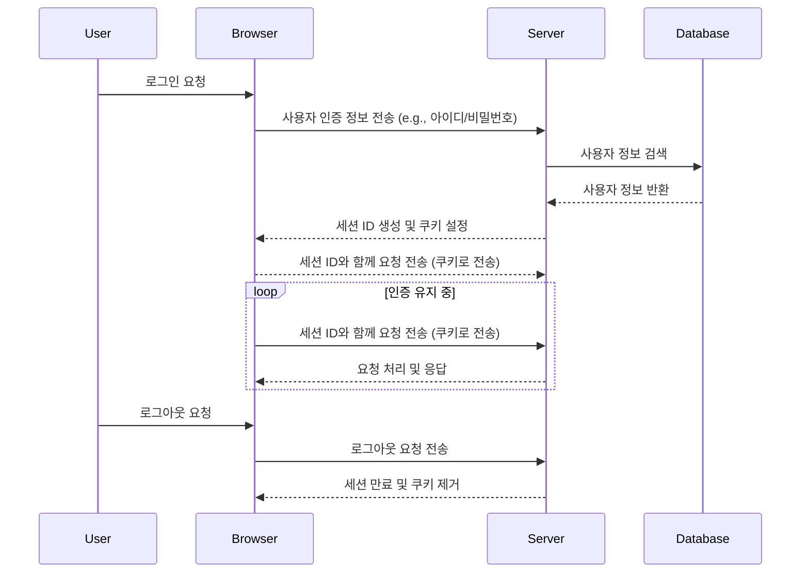
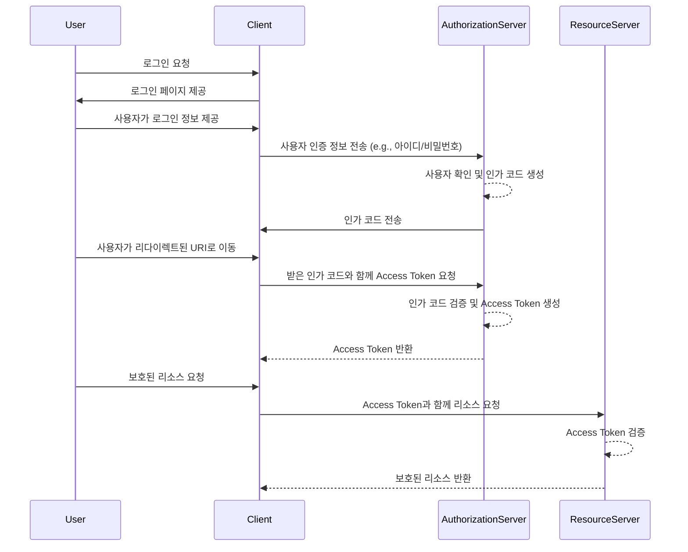
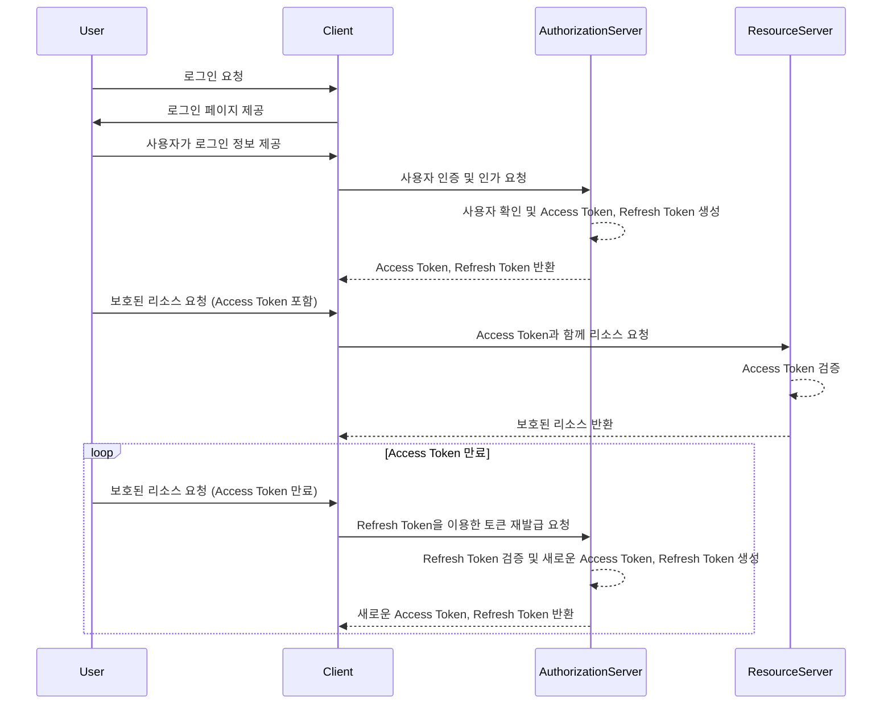

# 스프링 시큐리티 (Spring Security)
- 스프링 시큐리티란 어플리케이션의 보안(인증 및 인가)을 담당하는 프레임 워크
- 서블릿 필터와 이들로 구성된 필터체인으로 구성된 위임 모델을 사용한다.
- 보안 관련해서 많은 옵션을 제공해주어 개발자가 일일이 보안 관련 로직을 작성하지 않아도 된다는 장점이 있다.
- Spring Security를 사용하지 않으면 자체적으로 세션을 사용하여 체크하던가 기타 다른 방법으로 체크를 해주어야 한다.

### 장점
- 보안과 관련하여 체계적으로 많은 옵션을 제공하여 편리하게 사용할 수 있음
- Filter 기반으로 동작하여 MVC와 분리하여 관리 및 동작 
- 어노테이션을 통한 간단한 설정
- Spring Security는 기본적으로 세션 & 쿠키방식으로 인증

### 인증과 인가
- 인증`Authentication`: 해당 사용자가 본인이 맞는지를 확인하는 절차
- 인가`Authorization`: 인증된 사용자가 요청한 자원에 접근 가능한지를 결정하는 절차
- Spring Security는 기본적으로 인증 절차를 거친 후에 인가 절차를 진행하게 된다.
- 인증은 사용자의 신원 확인에 관한 과정이며, 인가는 사용자가 특정 리소스 또는 기능에 대한 권한을 가지고 있는지 확인하는 과정. 일반적으로 로그인 프로세스는 사용자의 인증을 처리하고, 그 이후의 권한 검사는 인가에 해당.
- Spring Security에서는 이러한 인증과 인가를 위해 Principal을 아이디로, Credential을 비밀번호로 사용하는 Credential 기반의 인증 방식을 사용한다. 

### Spring Security 적용시 필수 구현

1. Spring Security Dependency
2. Spring Security Configuration 클래스 구현
3. UserDetailsService 상속 (인증 Provider 또는 UserDetailsService 구현)
4. CSRF Token Header

#### 1. Spring Security Dependency 예시

build.gradle

```groovy
dependencies {
  implementation 'org.springframework.boot:spring-boot-starter-security'
}
```

#### 2. Spring Security Config 예시

> `WebSecurityConfigurerAdapter`를 상속하거나 `SecurityConfigurerAdapter`를 사용하여 보안에 대한 설정을 정의한다. 보통 @Configuration 및 @EnableWebSecurity 어노테이션을 클래스에 추가한다.  

> 액세스 권한 부여 규칙 설정: 어떤 URL 패턴에 어떤 역할(role)이 접근할 수 있는지 설정해야 한다. 이는 configure(HttpSecurity http) 메서드에서 수행한다.

WebSecurityConfigurerAdapter를 상속받아 커스텀한 AuthenticationConfig 클래스를 정의하는 AuthenticationConfig 

```java
import org.springframework.context.annotation.Configuration;
import org.springframework.security.config.annotation.web.builders.HttpSecurity;
import org.springframework.security.config.annotation.web.configuration.EnableWebSecurity;
import org.springframework.security.config.annotation.web.configuration.WebSecurityConfigurerAdapter;
import org.springframework.security.config.http.SessionCreationPolicy;

@Configuration
@EnableWebSecurity
public class AuthenticationConfig extends WebSecurityConfigurerAdapter {

    @Override
    protected void configure(HttpSecurity http) throws Exception {
        http.csrf().disable()
                .authorizeRequests()
                .antMatchers("/api/*/users/join", "/api/*/users/login").permitAll()
                .antMatchers("/api/**").authenticated()
                .and()
                .sessionManagement()
                .sessionCreationPolicy(SessionCreationPolicy.STATELESS)
                ;
    }
}
```

> "/api/*/users/join", "/api/*/users/login" 엔드포인트는 모든 사용자에게 허옹  
> "/api/**"패턴에 해당하는 엔드포인트는 인증된 사용자에게만 허용하는 stateless한 보안 구성

(1) `@Configuration` : 이 클래스가 스프링의 설정 클래스임을 나타냄  
(2) `@EnableWebSecurity` : 웹 보안설정을 활성화하도록 함  
(3) `@http.csrf().disable()` : CSRF 보호를 비활성화 처리. 주로 stateless한 RESTful 서비스에서 사용됨  
(4) `.authorizeRequests()` : 요청에 대한 접근 권한 설정  
  - `.antMatchers("/api/*/users/join", "/api/*/users/login").permitAll()` : `"/api/*/users/join", "/api/*/users/login"`에 대한 요청은 모든 사용자에게 허용
  - `.antMatchers("/api/**").authenticated()` : `"/api/**"`에 대한 요청은 인증된 사용자에게만 허용  

(5) `.and()` : 다음 설정을 연결  
(6) `.sessionManagement()` : 세션 관리 설정을 구성  
  -`.sessionCreationPolicy(SessionCreationPolicy.STATELESS)` : 서버는 세션을 생성하지 않고, 각 요청은 서버에 의존하지 않고 독립적으로 처리됨. 주로 stateless한 RESTful 서비스에서 사용됨

##### CSRF `Cross-Site Request Forgery` 란?

- 악의적인 웹사이트가 인증된 사용자의 권한으로 요청을 보내는 공격
- 사용자가 이미 인증된 상태에서 공격자가 의도하지 않은 행동을 수행하도록 유도하는 공격
- 예를 들어, 사용자가 은행 웹사이트에 로그인한 상태에서, 공격자가 제작한 악성 웹사이트를 열면 그 웹사이트에서 은행에 돈을 이체하는 요청을 자동으로 생성하고, 이를 은행 웹사이트로 전송할 수 있다. 이 경우 사용자는 이미 로그인되어 있기 때문에 은행은 해당 요청을 정상적인 것으로 인식하게 된다.

###### Spring Security에서의 CSRF

- Spring Security에서 CSRF 공격을 막기 위해 기본적으로 CSRF 토큰을 사용
- 이 토큰은 사용자의 세션과 관련이 있으며, 매 요청마다 이 토큰을 확인하여 요청의 유효성을 검증

-` http.csrf().disable()`를 사용하는 부분이 CSRF 보호를 비활성화하는 부분
- 주로 RESTful API 서비스에서 사용되며, API 서비스는 주로 stateless하게 동작하므로 CSRF 토큰을 사용하지 않는 경우가 많다. 
- Stateful한 웹 어플리케이션에서는 CSRF 토큰을 사용하여 보안을 강화할 수 있다.

#### 3. 인증 Provider 또는 UserDetailsService 구현

> UserDetailsService는 사용자의 인증 정보를 로드하는 인터페이스이며, 구현체는 사용자 데이터를 어떻게 가져올지 정의해야 한다. 이 인터페이스를 구현하는 클래스에서 loadUserByUsername 메서드를 구현하여 실제 사용자 정보를 로드한다.

```java
@Service
public class CustomUserDetailsService implements UserDetailsService {
    // 사용자 정보를 데이터베이스 또는 다른 소스에서 가져오는 로직을 구현
}
```

`UserDetailsService` : 인터페이스에서 정의된 메서드 중 하나. 사용자의 이름(일반적으로는 사용자 아이디)을 받아서 해당 사용자에 대한 정보를 로드하는 역할

- 사용자 정보를 데이터베이스에서 가져오는 경우, `loadUserByUsername` 메서드는 주어진 사용자 이름(아이디)을 기반으로 데이터베이스에서 사용자 정보를 조회하고, 그 정보를 `UserDetails` 객체로 반환한다.
-  반환된 `UserDetails` 객체는 Spring Security에서 사용자의 인증 및 권한 부여에 활용된다.

```java
@Service
public class CustomUserDetailsService implements UserDetailsService {

    @Autowired
    private UserRepository userRepository;

    @Override
    public UserDetails loadUserByUsername(String username) throws UsernameNotFoundException {
        User user = userRepository.findByUsername(username)
                .orElseThrow(() -> new UsernameNotFoundException("User not found with username: " + username));

        return new org.springframework.security.core.userdetails.User(
                user.getUsername(),
                user.getPassword(),
                getAuthorities(user.getRoles())
        );
    }

    private Collection<? extends GrantedAuthority> getAuthorities(Set<Role> roles) {
        return roles.stream()
                .map(role -> new SimpleGrantedAuthority(role.getName()))
                .collect(Collectors.toList());
    }
}

```

## Spring Security의 구조


spring security는 세션-쿠키방식으로 인증  

1. 유저가 로그인을 시도 (http request)
2. AuthenticationFilter 에서부터 위와같이 user DB까지 타고 들어감
3. DB에 있는 유저라면 UserDetails 로 꺼내서 유저의 session 생성
4. spring security의 인메모리 세션저장소인 SecurityContextHolder에 저장
5. 유저에게 session ID와 함께 응답을 내려줌
6. 이후 요청에서는 요청쿠키에서 SESSIONID를 까봐서 검증 후 유효하면 Authentication를 쥐어준다.

### 세션-쿠키 인증 방식 

> 사용자가 로그인 상태를 유지하며, 인증이 필요한 요청을 할 때마다 세션 ID를 서버에 제공하여 세션을 확인하는 방식  

세션-쿠키 인증 방식은 사용이 편리하고 개발이 간편하지만, 보안 측면에서는 주의가 필요하며 서버 메모리 부하와 보안 취약점에 대한 고려가 필요하다. 최근에는 토큰 기반의 인증 방식(JWT 등)이 더 많이 사용되는 경향이 있다.

#### 세션-쿠키 인증 방식 Sequence Diagram



##### 인증 프로세스

(1) 사용자가 브라우저를 통해 로그인을 시도  
(2) 브라우저는 사용자의 인증 정보(예: 아이디와 비밀번호)를 서버로 전송  
(3) 서버는 전달받은 인증 정보를 이용하여 데이터베이스에서 사용자 정보를 검색  
(4) 데이터베이스는 사용자 정보를 서버에 반환  

##### 인가 프로세스

(5) 서버는 세션 ID를 생성하고, 이를 쿠키에 담아 브라우저로 전송  
(6) 브라우저는 이후의 모든 요청에서 세션 ID를 쿠키를 통해 서버로 전송하여 세션을 유지  
(7) 사용자가 로그아웃을 요청하면, 서버는 세션을 만료시키고 관련된 쿠키를 제거  

##### 세션-쿠키 인증 방식의 장점

###### 1. 사용이 편리하고 직관적

세션과 쿠키는 개발자가 직접 관리할 필요 없이 브라우저와 서버 사이에서 자동으로 처리되기 때문에 상대적으로 사용이 편리하고 직관적

###### 2. 서버 부하 감소

세션-쿠키 방식은 클라이언트 측에 세션 ID를 저장하고 서버는 세션 정보를 서버 메모리나 데이터베이스에 저장하는 방식이기 때문에 서버에 부하를 분산시킬 수 있다.

###### 3. 비로그인 상태에서도 일부 기능 사용 가능

세션-쿠키 방식에서는 로그인하지 않은 사용자도 일부 기능을 사용할 수 있도록 설계할 수 있다.

##### 세션-쿠키 인증 방식의 단점

###### 1. 서버 메모리 부하

세션을 서버 메모리에 저장하는 경우, 많은 사용자가 동시에 접속하는 경우 서버 메모리 부하가 발생할 수 있다.

###### 2. 세션 하이재킹 위험

세션 ID를 탈취하여 다른 사용자의 세션을 가로채는 세션 하이재킹 공격이 발생할 수 있다. 이를 방지하기 위해서는 세션에 대한 보안 강화가 필요하다.

###### 3. 로그인 상태의 유지

세션-쿠키 방식은 사용자가 로그아웃하거나 세션이 만료되기 전까지 로그인 상태를 유지한다. 이는 사용자가 의도치 않게 로그인 상태를 유지하는 경우가 발생할 수 있다.

###### 4. CSRF 공격 가능성

쿠키를 사용한 경우, CSRF 공격이 발생할 수 있다. 이에 대한 방어 메커니즘이 추가로 필요하다.


# JWT

- JWT는 토큰의 형식 중 하나로, JSON 형태로 인코딩된 토큰이다.
- 주로 인증을 위해 사용되며, 클레임(claim)이라는 정보를 담고 있다.
- JWT는 자가 수용적(self-contained)이기 때문에 추가 저장소 없이도 정보를 전달할 수 있다. JSON 객체를 사용해서 토큰 자체에 정보를 저장하고 있는 Web Token이다.
- RFC 7519 웹 표준으로 지정되어 있다.
- 헤비하지 않게 사용 가능하다.
- Cookie & Session은 서버의 어떠한 저장소에 해당 값과 매칭되는 value를 가지고 있어야 한다. 그래서 서버 자원이 많이 사용되는 단점이 있다.
- JWT는 Cookie & Session의 자원 문제를 해결하기 위한 방법이다. JWT는 토큰 자체에 유저 정보를 담아서 암호화한 토큰이라고 생각하면 된다. 암호화된 내용은 디코딩 과정을 통해서 해석이 가능하다.

## JWT의 구성

- **Header** : Signature를 해싱하기 위한 알고리즘 정보가 담겨 있다. `Header`, `Payload`, `Verify Signature`를 암호화할 방식(Application Layer Gateway)과 타입 포함.
- **Payload** : 서버와 클라이언트가 주고 받는 시스템에서 실제로 사용될 정보를 담고 있다. 클라이언트에 대한 정보, 권한 등이 포함(user의 id, 유효기간 포함)
- **Signature** : 토큰의 유효성 검증을 위한 문자열. 이 문자열을 통해 서버에서는 이 토큰이 유효한 토큰인지 검증할 수 있다. Base64 방식으로 인코딩한 `Header`, `Payload`, `Secret Key`를 더한 값. 

### JWT를 통한 인증절차
1. 사용자가 로그인을 한다.
2. 서버에서는 계정 정보를 읽어 사용자 확인 후, 사용자의 고유ID값을 부여하고 기타 정보와 함께 `Payload`에 집어넣는다.
3. JWT 토큰의 유효기간을 설정한다.
4. 암호화할 Secret key를 이용해 `Access Token`을 발급한다.
5. 사용자는 `Access Token`을 받아 저장 후, 인증이 필요한 요청마다 토큰을 헤더에 실어 보낸다.
6. 서버에서는 해당 토큰의 `Verify Signature`를 secret key로 복호화한 후, 조작여부, 유효기간을 확인한다.
7. 검증이 완료되었을 경우 `Payload`를 디코딩하여 사용자의 ID에 맞는 데이터를 가져온다.

> JWT는 보통 Access Token의 유효기간은 매우 짧다. 이유는 보안 문제 때문이다. 그래서 Refresh Token을 따로 발급해주는데, Access Token이 만료되면 새로운 JWT를 발급할 수 있는 토큰이다.

### Access Token

> JWT는 Access Token의 한 종류다. OAuth 2.0 프로토콜에서는 JWT말고도 다양한 토큰 형식을 지원한다.

- 정의 : 일반적으로 OAuth 2.0 프로토콜에서 사용되는 토큰으로, 클라이언트가 자원 서버에 접근할 때 사용되는 인증 정보

- 특징: Access Token의 형식은 OAuth 2.0 프로토콜에 의해 정의되어 있지만, 그 형식은 명확하게 규정되어 있지 않다. OAuth 2.0에서는 토큰의 형식을 명시하지 않고, 각각의 서비스 또는 인증 서버에서 독자적으로 정의한다.

#### Access Token을 이용한 인증 프로세스



###### 1. 로그인 요청 및 사용자 인증

- 사용자는 클라이언트에게 로그인을 요청하고, 클라이언트는 사용자에게 로그인 페이지를 제공한다.
- 사용자는 로그인 정보를 입력하고, 클라이언트는 Authorization Server에 사용자의 인증 정보를 전송하여 사용자를 확인하고 인가 코드를 생성한다.

###### 2. Access Token 요청 및 발급

- 사용자가 로그인한 후 클라이언트가 Authorization Server에게 인가 코드를 이용해 Access Token을 요청한다.
- Authorization Server는 인가 코드의 유효성을 검증하고, 검증이 성공하면 Access Token을 발급한다.

###### 3. 보호된 리소스 요청

- 사용자가 보호된 리소스에 접근하려면 클라이언트는 발급받은 Access Token을 이용하여 Resource Server에 리소스를 요청한다.
- Resource Server는 Access Token을 검증하고, 유효한 경우 보호된 리소스를 클라이언트에게 반환한다.

#### Refresh Token을 이용한 인증 프로세스

>  Refresh Token을 이용하면 Access Token이 만료되었을 때 클라이언트는 사용자에게 다시 로그인을 요청하지 않고도 새로운 Access Token을 얻을 수 있다.



###### 1. 로그인 및 Access Token, Refresh Token 발급
   - 사용자가 로그인을 요청하면 클라이언트는 사용자에게 로그인 페이지를 제공한다.
   - 사용자가 로그인 정보를 제공하면 클라이언트는 Authorization Server에 사용자 인증 및 인가 요청을 하고, Authorization Server는 Access Token과 Refresh Token을 발급하여 클라이언트에게 반환한다.

###### 2. 보호된 리소스 요청 및 Access Token 갱신
   - 사용자가 보호된 리소스에 접근할 때 클라이언트는 발급받은 Access Token을 사용하여 Resource Server에 리소스를 요청한다.
   - 만약 Access Token이 만료되었다면 클라이언트는 Refresh Token을 이용하여 Authorization Server에게 새로운 Access Token을 요청하고, Authorization Server는 새로운 Access Token과 함께 Refresh Token을 반환한다.


#### JWT의 장점
- 중앙의 인증서버, 데이터 스토어에 대한 의존성이 없다.
- 시스템 수평적 확장에 유리하다.
- Base64 URL Safe Encoding > URL, Cookie, Header 모두 사용이 가능하다.
  - `Base64`란? 8비트 이진 데이터(실행파일, zip파일 등)를 문자 코드에 영향을 받지 않는 공통 ASCII영역의 문자들로만 이루어진 문자열로 바꾸는 인코딩 방식.  ASCII 문자 하나가 64진법의 숫자 하나를 의미하기 때문에 BASE64라는 이름을 가졌다.

#### JWT의 단점
- Payload의 정보가 많아지면 네트워크 사용량이 증가한다. 
- 데이터 설계를 고려할 필요가 있다.
- 토큰이 클라이언트에 저장된다. 서버에서 클라이언트의 토큰을 조작할 수 없다.

# Spring Security와 JWT를 함께 사용하기

##### 1. Spring security와 jwt관련 라이브러리를 build.gradle에 추가
##### 2. security와 filter 관련 설정 하기


```java
@RequiredArgsConstructor
@EnableWebSecurity
public class SecurityConfig extends WebSecurityConfigurerAdapter {

    private final JwtTokenProvider jwtTokenProvider;

    // authenticationManager를 Bean 등록합니다.
    @Bean
    @Override
    public AuthenticationManager authenticationManagerBean() throws Exception {
        return super.authenticationManagerBean();
    }

    @Override
    protected void configure(HttpSecurity http) throws Exception {

        http.csrf().disable();
        //http.httpBasic().disable(); // 일반적인 루트가 아닌 다른 방식으로 요청시 거절, header에 id, pw가 아닌 token(jwt)을 달고 간다. 그래서 basic이 아닌 bearer를 사용
        http.httpBasic().disable()
                .authorizeRequests()// 요청에 대한 사용권한 체크
                .antMatchers("/test").authenticated()
                .antMatchers("/admin/**").hasRole("ADMIN")
                .antMatchers("/user/**").hasRole("USER")
                .antMatchers("/**").permitAll()
                .and()
                .addFilterBefore(new JwtAuthenticationFilter(jwtTokenProvider),
                        UsernamePasswordAuthenticationFilter.class); // JwtAuthenticationFilter를 UsernamePasswordAuthenticationFilter 전에 넣는다
        // + 토큰에 저장된 유저정보를 활용하여야 하기 때문에 CustomUserDetailService 클래스를 생성
        http.sessionManagement().sessionCreationPolicy(SessionCreationPolicy.STATELESS);
    }
}
```
(1) `AuthenticationManager`를 Bean으로 등록해준다.  
(2) 설정해야 할 목록  
- `antMatchers()` : 해당 URL로 요청 시 설정을 해준다.
- `authenticated()` : `andMatchers`에 속해있는 URL로 요청이 오면 인증이 필요하다고 설정한다.
- `hasRole()` : `andMatchers`에 속해있는 URL로 요청이 들어오면 권한을 확인한다.  
(3) `addFilterBefore()` : 필터를 등록한다. 스프링 시큐리티 필터링에 등록해주어야 하기 때문에, 여기에 등록해주어야 한다. 파라미터는 2가지가 들어간다. 왼쪽은 커스텀한 필터링이 들어간다. 오른쪽에 등록한 필터전에 커스텀필터링이 수행된다.  
(4) `http.sessionManagement().sessionCreationPolicy(SessionCreationPolicy.STATELESS)` : 세션을 사용하지 않는다고 설정한다.  


##### 3. Custom Filter 구현하기

```java
//해당 클래스는 JwtTokenProvider가 검증을 끝낸 Jwt로부터 유저 정보를 조회해와서 UserPasswordAuthenticationFilter 로 전달
@RequiredArgsConstructor
public class JwtAuthenticationFilter extends GenericFilterBean {

    private final JwtTokenProvider jwtTokenProvider;

    @Override
    public void doFilter(ServletRequest request, ServletResponse response, FilterChain chain) throws IOException, ServletException {
        // 헤더에서 JWT 를 받아옴
        String token = jwtTokenProvider.resolveToken((HttpServletRequest) request);
        // 유효한 토큰인지 확인합니다.
        if (token != null && jwtTokenProvider.validateToken(token)) {
            // 토큰이 유효하면 토큰으로부터 유저 정보를 받아옴
            Authentication authentication = jwtTokenProvider.getAuthentication(token);
            // SecurityContext 에 Authentication 객체를 저장
            SecurityContextHolder.getContext().setAuthentication(authentication);
        }
        chain.doFilter(request, response);
    }
}
```

##### 4. Custom Provider 구현하기

- Custom Authentication Provider를 구현하여 사용하는 방법은 사용자의 인증 로직을 커스터마이징하는데 유용하다. - Custom Authentication Provider는 기존의 사용자 인증 로직을 대체하고, 특정 인증 방식을 처리하는 역할을 한다.


**Custom Authentication Provider**


- AuthenticationProvider를 구현하여 JWT를 처리하는 사용자 정의 프로바이더
- JwtAuthenticationToken과 JwtUserDetails 클래스를 적절히 구현하여 토큰을 처리하고 사용자 정보를 추출할 수 있다. 
- 이를 Spring Security 설정에서 등록하여 사용한다.

```java
import org.springframework.security.authentication.AuthenticationProvider;
import org.springframework.security.core.Authentication;
import org.springframework.security.core.AuthenticationException;

public class JwtAuthenticationProvider implements AuthenticationProvider {

    @Override
    public Authentication authenticate(Authentication authentication) throws AuthenticationException {
        JwtAuthenticationToken jwtAuthenticationToken = (JwtAuthenticationToken) authentication;
        String token = jwtAuthenticationToken.getToken();

        // JWT 검증 및 사용자 정보 추출 로직을 구현

        // 사용자 정보를 기반으로 Authentication 객체 생성
        JwtUserDetails userDetails = buildUserDetailsFromToken(token);
        return new JwtAuthenticationToken(userDetails, token, userDetails.getAuthorities());
    }

    @Override
    public boolean supports(Class<?> authentication) {
        return JwtAuthenticationToken.class.isAssignableFrom(authentication);
    }

    private JwtUserDetails buildUserDetailsFromToken(String token) {
        // JWT에서 사용자 정보를 추출하여 UserDetails 객체 생성
        // (예: 토큰 디코딩, 사용자 정보 읽기)
        // ...

        return new JwtUserDetails(username, authorities);
    }
}
```

**JwtAuthenticationToken 및 UserDetails 구현**

```java
import org.springframework.security.authentication.UsernamePasswordAuthenticationToken;
import org.springframework.security.core.GrantedAuthority;

import java.util.Collection;

public class JwtAuthenticationToken extends UsernamePasswordAuthenticationToken {

    private String token;

    public JwtAuthenticationToken(Object principal, Object credentials) {
        super(principal, credentials);
    }

    // 생성자, getter, setter 등 필요한 메서드 구현

    public String getToken() {
        return token;
    }
}

import org.springframework.security.core.GrantedAuthority;
import org.springframework.security.core.userdetails.User;

import java.util.Collection;

public class JwtUserDetails extends User {

    public JwtUserDetails(String username, Collection<? extends GrantedAuthority> authorities) {
        super(username, "", authorities);
    }
}
```

**Spring Security 설정에 Custom Provider 등록**

```java
import org.springframework.context.annotation.Bean;
import org.springframework.context.annotation.Configuration;
import org.springframework.security.authentication.AuthenticationProvider;
import org.springframework.security.config.annotation.authentication.builders.AuthenticationManagerBuilder;
import org.springframework.security.config.annotation.web.builders.HttpSecurity;
import org.springframework.security.config.annotation.web.configuration.EnableWebSecurity;
import org.springframework.security.config.annotation.web.configuration.WebSecurityConfigurerAdapter;

@Configuration
@EnableWebSecurity
public class SecurityConfig extends WebSecurityConfigurerAdapter {

    @Bean
    public AuthenticationProvider authenticationProvider() {
        return new JwtAuthenticationProvider();
    }

    @Override
    protected void configure(AuthenticationManagerBuilder auth) throws Exception {
        auth.authenticationProvider(authenticationProvider());
    }

    @Override
    protected void configure(HttpSecurity http) throws Exception {
        // 다른 보안 설정을 추가할 수 있음
    }
}
```

###### reference

> [Cross Site Request Forgery (CSRF)](https://docs.spring.io/spring-security/reference/features/exploits/csrf.html)
> [모두를 위한 JWT](https://velog.io/@jeonjay/%EB%AA%A8%EB%91%90%EB%A5%BC-%EC%9C%84%ED%95%9C-JWT)
> [Spring boot - security-jwt 연동과 흐름(feat.AccessToken, RefreshToken)](https://kdg-is.tistory.com/228)  
> [Spirng Security + Jwt 로그인 적용하기](https://velog.io/@jkijki12/Spirng-Security-Jwt-%EB%A1%9C%EA%B7%B8%EC%9D%B8-%EC%A0%81%EC%9A%A9%ED%95%98%EA%B8%B0)  
> [베이스64](https://ko.wikipedia.org/wiki/%EB%B2%A0%EC%9D%B4%EC%8A%A464#cite_ref-2)  
> [spring security 파헤치기 (구조, 인증과정, 설정, 핸들러 및 암호화 예제, @Secured, @AuthenticationPrincipal, taglib)](https://sjh836.tistory.com/165)
