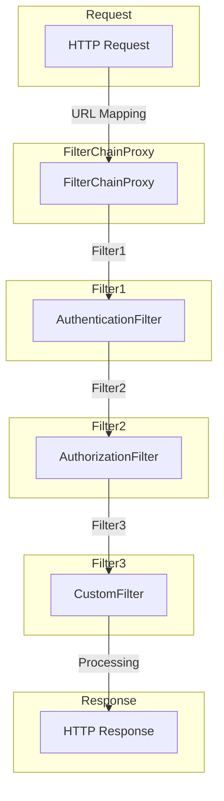
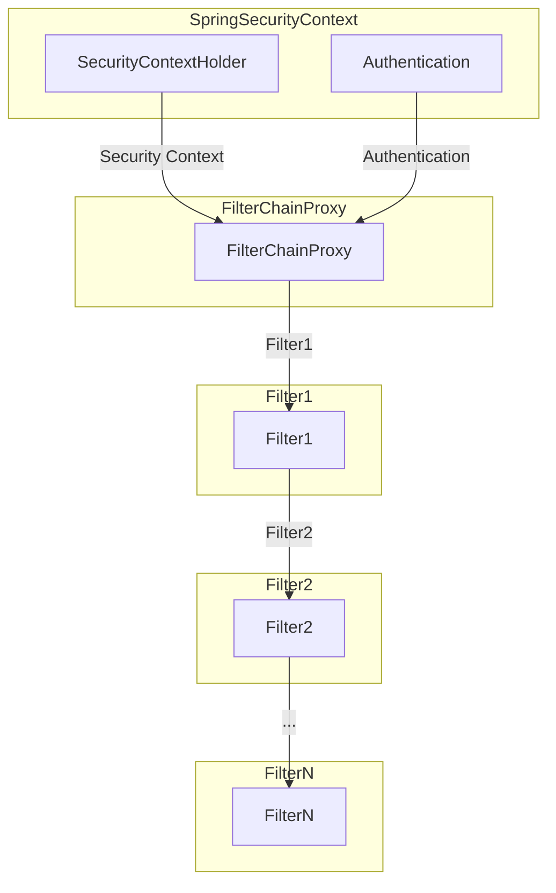

## Spring security

```mermaid
graph TD
  subgraph SpringSecurityFilterChain
    A[SecurityContextPersistenceFilter]
    B[ConcurrentSessionFilter]
    C[LogoutFilter]
    D[UsernamePasswordAuthenticationFilter]
    E[BasicAuthenticationFilter]
    F[RequestCacheAwareFilter]
    G[SecurityContextHolderAwareRequestFilter]
    H[AnonymousAuthenticationFilter]
    I[SessionManagementFilter]
    J[ExceptionTranslationFilter]
    K[FilterSecurityInterceptor]
  end

  A -->|Next| B
  B -->|Next| C
  C -->|Next| D
  D -->|Next| E
  E -->|Next| F
  F -->|Next| G
  G -->|Next| H
  H -->|Next| I
  I -->|Next| J
  J -->|Next| K

```

<<<<<<< HEAD

Spring Security의 Filter Chain에는 다양한 필터들이 포함되어 있으며, 이들은 보안 처리를 담당함. 다음은 Spring Security의 기본 필터 체인에 속한 몇 가지 주요 필터들의 순서. 이 순서는 Spring Security 5 버전을 기준으로 함.

1. **SecurityContextPersistenceFilter:**
   - 현재 사용자의 `SecurityContext`를 영속화하고 로드하는 역할을 함.

2. **ConcurrentSessionFilter:**
   - 동시 세션 제어를 수행하는 필터로, 한 사용자의 동시 로그인을 제한하는 등의 작업을 수행함.

3. **LogoutFilter:**
   - 로그아웃 요청을 처리하는 필터. 로그아웃이 요청되면 현재 사용자를 로그아웃 처리하고 필요에 따라 리다이렉션함.

4. **UsernamePasswordAuthenticationFilter:**
   - 사용자명과 비밀번호를 이용한 폼 기반 인증을 처리하는 필터.

5. **BasicAuthenticationFilter:**
   - HTTP 기본 인증을 처리하는 필터. 주로 HTTP의 `Authorization` 헤더를 통해 인증을 수행함.

6. **RequestCacheAwareFilter:**
   - 요청 캐시와 관련된 작업을 처리하는 필터로, 주로 로그인 후 이전 요청으로 리다이렉션을 처리함.

7. **SecurityContextHolderAwareRequestFilter:**
   - Spring Security의 `SecurityContextHolder`를 이용하여 `HttpServletRequest`를 래핑하는 역할을 하는 필터.

8. **AnonymousAuthenticationFilter:**
   - 사용자가 인증되지 않은 경우 익명 사용자를 생성하는 필터.

9. **SessionManagementFilter:**
   - 세션 관리와 관련된 작업을 수행하는 필터로, 세션 고정 보호 및 세션 타임아웃과 같은 기능을 수행함.

10. **ExceptionTranslationFilter:**
    - 인증 및 권한 예외를 적절한 HTTP 응답으로 변환하는 필터.

11. **FilterSecurityInterceptor:**
    - 가장 마지막에 위치하는 필터로, URL 기반의 권한 검사를 수행함. 리소스에 접근하기 전에 권한을 확인함.

###### reference

=======
>>>>>>> f462cae (til: 2023 회고)
### FilterChain

- FilterChain은 웹 애플리케이션에서 보안을 처리하는 데 사용되는 필터(또는 인터셉터)의 연쇄이다. 
- FilterChain은 Spring Security가 제공하는 여러 필터들이 순차적으로 실행되도록 구성되어 있다. 
- 각 필터는 특정한 보안 작업을 담당하며, 전체적으로 연결되어 사용자 인증 및 권한 부여와 같은 보안 작업을 처리한다.

### FilterChainProxy

###### reference

> [점프 투 스프링 부트](https://wikidocs.net/160957#requiredargsconstructor)  
<<<<<<< HEAD
> [Error Handling for REST with Spring](https://www.baeldung.com/exception-handling-for-rest-with-spring)
=======
> [Error Handling for REST with Spring](https://www.baeldung.com/exception-handling-for-rest-with-spring)
>>>>>>> f462cae (til: 2023 회고)
