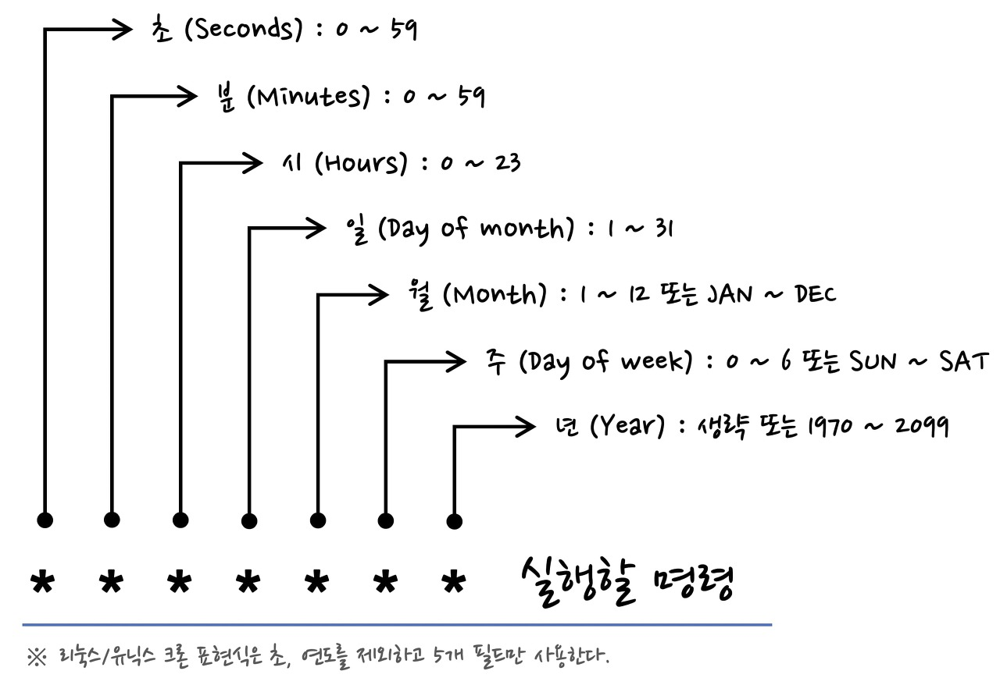
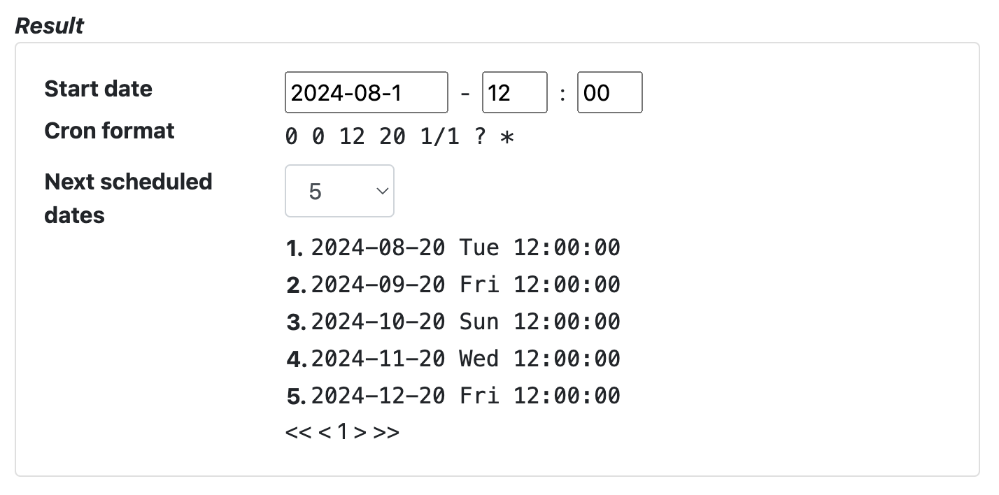
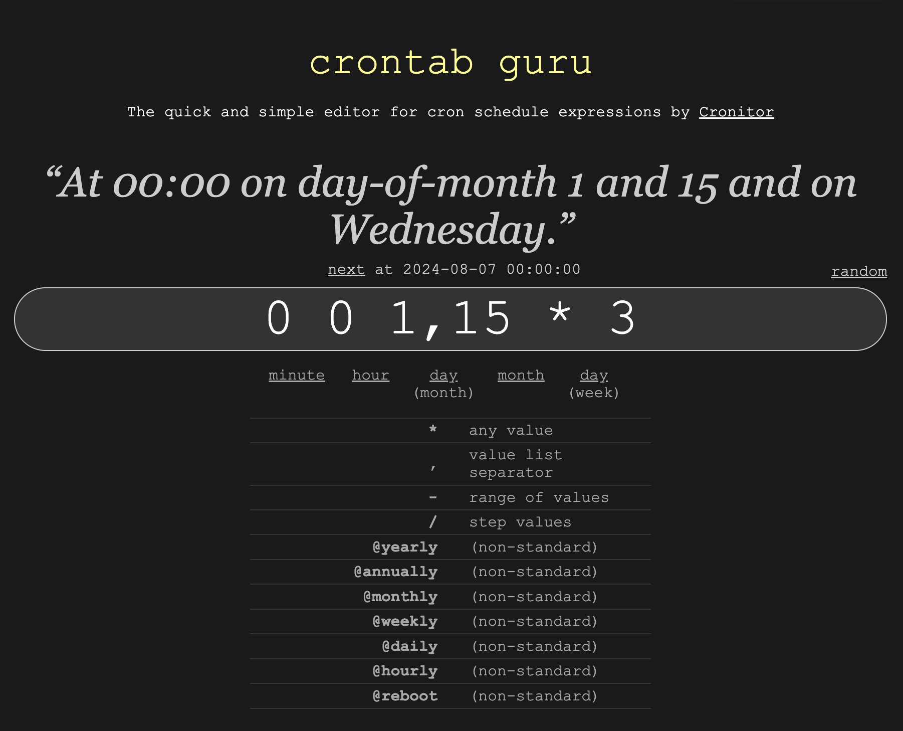

# Scheduling 이란?

- 일정시간 간격으로 반복적인 작업을 수행하는 도구
- 배치 스케줄링과 다른 점:
  - 배치 프로그램은 대량의 데이터를 처리하는 작업을 자동화 하는 프로그램을 의미한다.
  - 배치 프로그램은 일괄 처리를 위한 프로그램이며 정해진 시간에 실행되지 않고 사용자의 명령이 있을 때 실행한다.
  - 스케줄러는 정해진 시간에 자동으로 실행되는 프로그램이며 주기적으로 실행되는 작업을 설정할 수 있다.

java.util.Timer, Spring Scheduler, Quartz등을 활용해서 스케줄링 기능을 활용할 수 있다.  

## java.util.Timer

* **기본적인 자바 타이머 클래스:** Java SE에서 제공하는 가장 기본적인 타이머 클래스. 순수 자바에서 사용
* **TimerTask 인터페이스:** TimerTask 인터페이스를 구현한 클래스를 스케줄링하여 특정 시간에 작업을 실행
* **단순한 스케줄링:** 간단한 스케줄링 작업에 적합하며, 크론 표현식과 같은 복잡한 스케줄링 기능은 지원하지 않음
* **스프링과의 통합:** 스프링 환경에서 사용하기 위해 별도의 설정이 필요하며, 스프링 컨테이너와의 통합이 자연스럽지 않음
* **제한적인 기능:** 스케줄링 기능 외에 부가적인 기능은 거의 제공하지 않음

| 비교 항목 | java.util.Timer | Spring Scheduler |
|---|---|---|
| **복잡도** | 간단 | 복잡한 스케줄링도 가능 |
| **스프링 통합** | 별도 설정 필요 | 스프링 컨테이너와 긴밀하게 통합 |
| **기능** | 기본적인 스케줄링 기능만 제공 | 크론 표현식 지원, 스프링 AOP 활용 등 |
| **사용 편의성** | 상대적으로 낮음 | 높음 |

* **java.util.Timer:**
    * 간단한 스케줄링 작업
    * 스프링 환경이 아닌 일반적인 자바 애플리케이션
    * 복잡한 스케줄링 기능이 필요하지 않은 경우
* **@Scheduled:**
    * 스프링 부트 환경에서 스케줄링 작업
    * 크론 표현식을 사용한 다양한 주기의 작업
    * 스프링 컨테이너와의 통합이 필요한 경우
    * 부가적인 기능(로깅, 트랜잭션 관리 등)이 필요한 경우

## 스프링 스케줄러란?

- 스프링 스케줄러는 마치 알람 시계처럼, **특정 시간**이나 **주기적으로** 특정 작업을 자동으로 실행시켜주는 스프링 프레임워크의 기능

### 스프링 스케줄러를 사용하면 좋은 이유

예를 들어,
- 매일 새벽 2시에 백업 작업 실행하기
- 1시간마다 서버 상태를 체크하고 로그에 기록하기
- 특정 요일에만 특정 기능을 실행하기  
와 같은 작업들을 스케줄러를 통해 자동화할 수 있다.

* **정기적인 작업 자동화:** 매일, 매주, 매달 등 정해진 주기에 따라 반복되는 작업들을 일일이 수동으로 실행할 필요가 없다.
* **시스템 관리 효율성 향상:** 시스템 상태를 주기적으로 점검하거나, 로그를 정리하는 등의 작업을 자동화하여 관리 부담을 줄일 수 있다.
* **데이터 백업:** 중요한 데이터를 정기적으로 백업하여 데이터 손실 위험을 줄일 수 있다.
* **배치 작업 실행:** 대량의 데이터 처리와 같은 배치 작업을 스케줄링하여 시스템 부하를 분산시킬 수 있다.

### 어떤 상황에서 사용하면 좋을까?

* **정기적인 보고서 생성:** 매일 아침, 특정 시간에 매출 보고서를 생성하여 관련 부서에 전달해야 할 경우
* **캐시 데이터 초기화:** 웹 서버의 캐시 데이터를 정기적으로 초기화하여 최신 데이터를 제공해야 할 경우
* **데이터베이스 백업:** 중요한 데이터베이스를 매일 밤 자정에 백업해야 할 경우
* **시스템 상태 점검:** 서버의 CPU 사용률, 메모리 사용량 등을 주기적으로 점검하여 문제 발생 시 알림을 받아야 할 경우
* **로그 파일 정리:** 로그 파일이 너무 커져 디스크 공간을 많이 차지하는 경우, 스케줄러를 통해 일정 기간이 지난 로그 파일을 자동으로 삭제하기


#### 사용 예시

```java
@Configuration
@EnableScheduling
public class SchedulingConfiguration {

    @Scheduled(cron = "0 0 * * * ?") // 매일 자정에 실행
    public void scheduleTaskWithFixedRate() {
        System.out.println("매일 자정에 실행되는 스케줄링 작업");
    }
}
```

위 예시는 매일 자정에 `scheduleTaskWithFixedRate` 메소드를 실행하는 간단한 스케줄링 설정이다. `@Scheduled` 애노테이션을 사용하여 스케줄링 정보를 설정하고, `cron` 속성을 통해 실행 주기를 지정한다.

```java
@Scheduled(cron = "0 0 2 * * ?") // 매일 새벽 2시에 실행
public void backupData() {
    // 데이터 백업 로직
}
```

## Cron 표현식이란?

- Cron 표현식은 **특정 시간이나 주기**를 나타내는 일종의 **시간 표현식** 
- 스프링 스케줄러뿐만 아니라 다양한 시스템에서 **정기적인 작업**을 예약할 때 사용된다. 

- 쉽게 말해, "매일 새벽 2시에", "매월 첫째 주 월요일 오후 3시에"와 같이 **언제 작업을 실행할지**를 정확하게 지정하는 방법이라고 생각하면 된다.

### Cron 표현식의 구조



Cron 표현식은 일반적으로 다음과 같은 형식으로 구성된다.

```
* * * * * *
```

각 별표(*)는 다음과 같은 의미다.

* **분:** 0부터 59까지
* **시:** 0부터 23까지
* **일:** 1부터 31까지 (월의 날짜)
* **월:** 1부터 12까지
* **요일:** 0부터 7까지 (0 또는 7은 일요일)
* **년도 (선택 사항):** 1970부터 2099까지

#### 예시

* **매일 새벽 2시에 실행:** `0 2 * * *`
* **매월 첫째 날 오전 9시에 실행:** `0 9 1 * *`
* **매주 월요일 오후 5시에 실행:** `0 17 * * 1`
* **매달 15일, 30일에 실행:** `0 0 15,30 * *`

### 특수 문자

Cron 표현식에서는 다음과 같은 특수 문자를 사용하여 더욱 복잡한 조건을 설정할 수 있다.

* `,` : 여러 값을 지정할 때 (예: `0,30`은 0분과 30분을 의미)
* `-` : 범위를 지정할 때 (예: `1-5`는 1부터 5까지를 의미)
* `*` : 모든 값을 의미
* `/` : 증가값을 지정할 때 사용 (예: `*/5`는 5분 간격으로 의미)
* `?` : 특정 필드에 해당하는 값이 없을 때 사용(예: 월별 스케줄링에서 요일 필드에 ?를 사용하면 특정 요일에 상관없이 실행)

### Cron 표현식 생성 도구

온라인에서 제공되는 Cron 표현식 생성기를 통해 미리 보기 기능을 통해 결과를 확인할 수 있다.

#### CronMaker (7자리 크론식)

[CronMaker](http://www.cronmaker.com/?0)




#### Crontab guru (5자리 크론식)

[Crontab guru](https://crontab.guru/)



### 주의사항

* **시간대:** Cron 표현식은 일반적으로 서버의 시간대를 기준으로 동작한다. 따라서 서버의 시간대 설정을 정확하게 해야 한다.
* **표준 시간과 서머타임:** 서머타임 적용 여부에 따라 스케줄이 변경될 수 있으므로 주의해야 한다.
* **복잡한 스케줄:** 매우 복잡한 스케줄링이 필요한 경우에는 Cron 표현식 대신 스프링 배치와 같은 전문적인 배치 처리 프레임워크를 사용하는 것이 좋다.
  - 크론 표현식: 간단한 반복 작업, 간단한 스케줄링
  - 스프링 배치: 복잡한 로직, 대량 데이터 처리, 오류 처리, 배치 처리 모니터링(배치 처리 성능을 측정하고 분석) 등 다양한 기능을 제공하여 안정적이고 효율적인 배치 처리를 가능

## Spring Boot Quartz

- Java 기반의 오픈 소스 작업 '스케줄링 라이브러리'를 의미. 이를 사용하면 특정시간에 작업을 실행하거나 특정 간격으로 작업을 수행할 수 있다.
- **스프링 스케줄러**:
  - 크론 표현식 기반의 간단한 스케줄링
  - 스프링 컨테이너와의 긴밀한 통합
  - `@Scheduled` 애노테이션을 사용한 간편한 설정
- **Quartz**:
  - 다양한 트리거(SimpleTrigger, CronTrigger, DailyTimeIntervalTrigger 등) 지원
  - 캘린더를 이용한 스케줄링(SimpleTrigger 외에도 다양한 트리거를 사용하여 복잡한 스케줄링을 구현)
  - 클러스터링 지원(여러 서버에서 동일한 잡을 실행해야 할 때)
  - 다양한 저장소(JDBC, RAMJobStore 등) 지원
  - 잡(Job) 실행 시 컨텍스트 정보 제공

### 언제 사용하면 좋을까?

- **스프링 스케줄러**:
  - 간단한 반복 작업 (예: 매일 밤 로그 파일 삭제, 매주 월요일 데이터 백업)
  - 스프링 애플리케이션 내에서 사용하는 작은 규모의 스케줄링
- **Quartz**:
  - 복잡한 스케줄링 (예: 특정 조건에 따른 실행, 여러 개의 잡 연동)
  - 대규모 분산 시스템에서의 스케줄링
  - 고가용성이 요구되는 시스템


###### Reference
> [Cron expression](https://madplay.github.io/post/a-guide-to-cron-expression)
> [Quartz](https://www.baeldung.com/quartz)