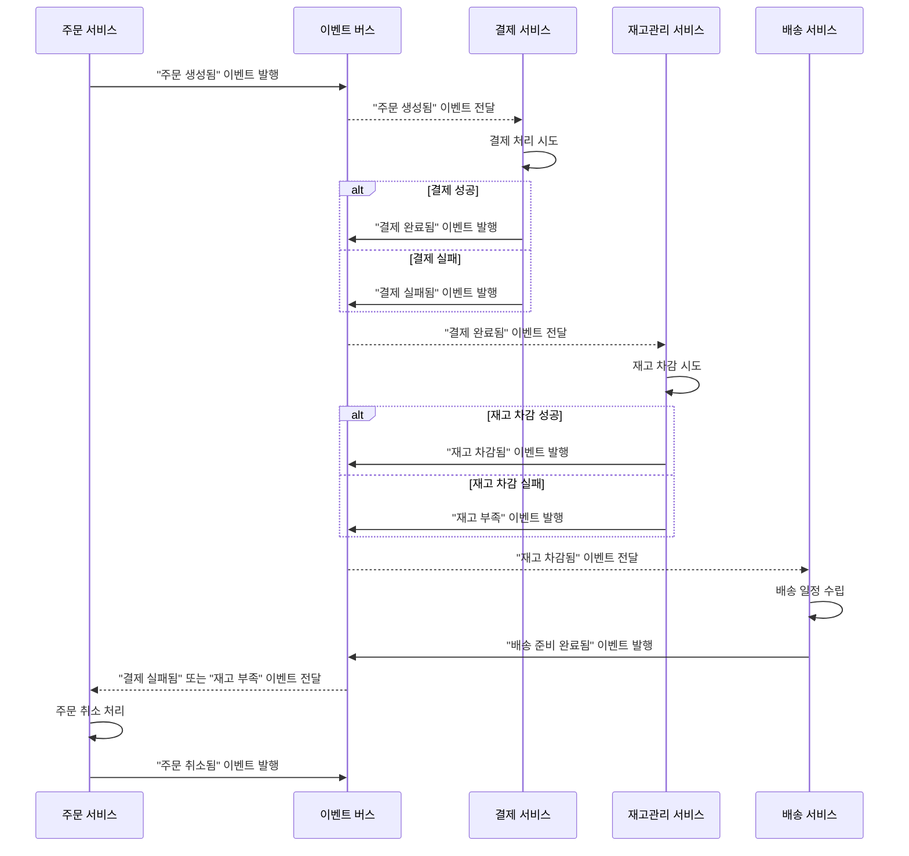
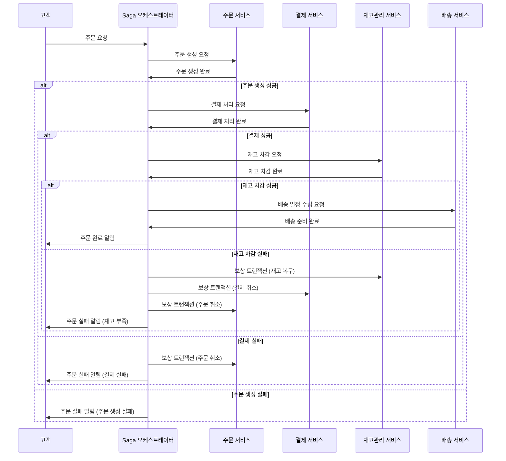

# MSA에서 트랜잭션

트랜잭션이란, 우리가 데이터를 이용해 수행하고자 하는 작업의 집합이다.  

분산 환경에서는 DB가 분리되어 있기 때문에 여러 DB의 원자성을 보장하기가 어렵다. 각 서비스가 다른 서비스와 일관성을 유지해야 하기 때문에 일반 트랜잭션보다 더 복잡하다.  

원자성이란, 트랜잭션의 연산은 DB에 모두 반영되거나, 모두 반영되지 않아야 하는 성질을 말한다.  
트랜잭션 내의 모든 명령은 반드시 수행되어야 하며, 하나라도 수행되지 않으면 트랜잭션이 취소되어야 한다.  

분산 트랜잭션을 관리하는 방안으로는 2Phase Commit, Saga 패턴이 있다.

## 2Phase Commit Pattern (2PC)

- 분산 트랜잭션의 원자성을 보장하기 위해 사용되는 프로토콜이다.
- 2PC는 모든 참여 노드가 트랜잭션을 성공적으로 완료하거나 모두 롤백하도록 한다.
- 2PC는 주로 데이터베이스 시스템에서 지원하는 기능으로, 데이터베이스 레벨에서 구현된다. 하지만 분산 트랜잭션을 관리하기 위해 아키텍처 설계 시에도 고려해야 한다.

#### 작동 방식:

분산 트랜잭션을 관리하는 주체인 `Coordinator`가 있다.

- **1단계 (Prepare Phase)**: 코디네이터가 모든 참여자에게 준비 요청을 보낸다. 각 참여자는 로컬 트랜잭션을 현재 상태로 완료할 수 있는지 확인하고 그 결과를 코디네이터에게 응답한다.
  - 트랜잭션 준비 여부 확인 후 해당 Row에 Lock을 설정한다.
  - 요청 처리 가능을 Coodinator에게 응답했을 때 바로 Commit 되지 않는다.
  - Prepare Phase에서는 해당하는 DB에 관련한 모든 서비스의 응답이 올 때까지 Lock을 설정한다.
- **2단계 (Commit Phase)**: **모든** 참여자가 준비 완료를 응답하면 코디네이터는 커밋을 지시하고, 그렇지 않으면 롤백을 지시한다.
  - 결정에 따라 코디네이터는 모든 참가자에게 커밋 또는 중단 요청을 보낸다. 
  - 각 참가자는 필요한 작업을 수행하고 획득한 lock을 해제한다. 그 후 각 참가자는 코디네이터에게 커밋 또는 중단 작업을 완료했음을 알려야 한다.

#### 2PC (Two-Phase Commit)의 장단점

- **장점**
  - **강한 데이터 일관성 보장**: 모든 참여 노드에서 트랜잭션이 일관되게 커밋되거나 롤백되므로 데이터 불일치가 발생하지 않는다.
  - **원자성 보장**: 트랜잭션의 원자성을 보장하여 부분 완료 상태를 방지한다.
  - **오류 복구 용이**: 트랜잭션 실패 시 자동으로 롤백되어 데이터 무결성을 유지한다.

- **단점**
  - **성능 저하**: 트랜잭션 동안 리소스가 잠금 상태로 유지되어 시스템 성능이 저하될 수 있다. latency가 증가할 수 있다. 
  - **복잡한 구현**: 코디네이터와 참여자 간의 복잡한 프로토콜 구현이 필요하다.
  - **단일 장애점 문제**: 코디네이터 실패 시 전체 시스템에 영향이 발생할 수 있다. 서비스간 강결합이 된다는 것이다.
  - **확장성 제한**: 노드 수가 증가할수록 지연 시간이 증가하여 확장에 제약이 있다. 관련 서비스 수와 비례에서 지연 시간이 길어질 수 있다.

## Saga Pattern

- 가 패턴은 주로 애플리케이션 레벨에서 구현되는 아키텍처 패턴
- 사가 패턴은 긴 트랜잭션을 여러 개의 로컬 트랜잭션으로 분할하고, 각 트랜잭션이 성공적으로 완료되도록 하는 기법이다. 만약 중간에 실패가 발생하면 이전에 완료된 트랜잭션에 대해 보상 작업을 수행한다.
- 이벤트 및 보상 트랜잭션 처리의 주체에 따라 구분된다.
  - **Choreographed Saga** : 이벤트 및 보상 트랜잭션 처리 주체가 각 마이크로 서비스
  - **Orchestrated Saga** : 이벤트 및 보상 트랜잭션 처리의 주체로 'Orchestrator'가 존재하여 중앙에서 처리

#### 작동 방식

- 트랜잭션을 순차적인 로컬 트랜잭션으로 분해한다. -> 메세지 브로커를 통해 이벤트를 Pub-sub하게 된다.
- 각 트랜잭션이 성공하면 다음 트랜잭션을 실행한다.
- 실패 시, 이전에 완료된 트랜잭션에 대한 보상(취소) 작업을 역순으로 실행한다. -> 보상 이벤트를 발행하여 트랜잭션을 롤백하는 보상 트랜잭션을 실행한다.
  - 보상 트랜잭션: 물리적으로 롤백한다는 것이아닌, 비즈니스적으로 롤백 처리한다는 것

#### 사가 패턴 (Saga Pattern)의 장단점

- **장점**
  - **확장성 향상**: 서비스 간의 느슨한 결합으로 시스템 확장이 용이하다.
  - **유연한 실패 처리**: 부분적인 실패에 대해 보상 트랜잭션을 사용하여 유연하게 대응한다.
  - **성능 향상**: 로컬 트랜잭션을 사용하므로 글로벌 락이 필요 없어서 성능이 향상된다.
  - **롱런 트랜잭션 지원**: 장시간 트랜잭션을 효과적으로 처리할 수 있다.

- **단점**
  - **데이터 일관성 보장 어려움**: 즉각적인 일관성을 보장하지 못하며, 최종적 일관성에 의존한다.
  - **보상 트랜잭션 필요**: 각 단계마다 보상 작업을 구현해야 하므로 개발 복잡도가 증가한다.
  - **오류 처리 복잡성**: 복잡한 오류 시나리오에 대한 처리 로직이 필요하다.
  - **데이터 불일치 위험**: 보상 트랜잭션 실패 시 데이터 불일치가 발생할 수 있다.

#### 2PC와 차이점

- 2PC: 관련 모든 서비스들의 DB 트랜잭션을 동시에 처리한다. 이를 위해 순차적으로 DB에 lock을 설정한다.
- Saga: 관련 모든 서비스들의 DB 트랜잭션을 순차적으로 처리한다.
  - 2PC가 모든 트랜잭션 상태가 정상이 아니면 전체 트랜잭션을 롤백하여 원자성을 보장했다면, saga는 '보상 트랜잭션'이라는 개념을 통해서 처리한다.

### Choreographed Saga

이벤트 보상 트랜잭션의 처리 주체는 각 마이크로 서비스의 메세지 브로커다.  

각 로컬 트랜잭션은 다른 서비스에서 로컬 트랜잭션을 트리거하는 이벤트를 게시한다.  

중앙 집중식 조정자 없이 각 서비스가 이벤트를 발행하고, 다른 서비스가 해당 이벤트를 구독(Subscribe) 하여 자신의 로컬 트랜잭션을 수행한다.  

- 각 서비스는 자신이 수행한 작업의 결과를 이벤트로 발행(Publish)한다.
- 다른 서비스들은 필요한 이벤트를 구독(Subscribe) 하여 해당 이벤트 발생 시 자신의 로직을 실행한다.
- 이벤트들은 이벤트 버스(Event Bus) 나 메시지 브로커(Message Broker) 를 통해 전달된다.

#### 작동방식 예시

1. 주문 서비스가 `POST /orders` 요청을 받고, `Order`를 대기상태로 생성한다.
2. `주문 생성` 이벤트를 발송한다.
3. 고객 서비스의 이벤트 핸들러가 주문금액을 고객의 잔액에서 지불하도록 예약 시도를 한다.
4. 고객 서비스가 결과 이벤트를 발송한다. 잔액에서 주문금액을 지불할 수 있다면 성공, 아니라면 실패 이벤트를 발송한다.
5. 주문 서비스의 이벤트 핸들러가 `Order`를 성공 이벤트를 받으면 `Order`를 승인 상태로 변경하고, 실패 이벤트를 받으면 `Order`를 거절상태로 변경한다.

어떤 단계라도 실패하면, 관련된 각 서비스는 변경 사항을 되돌리기 위해 보상 트랜잭션을 실행해야 한다.

##### 더 다양한 이벤트 발행 예시

#### **Orchestrated Saga의 장단점**

| **구분** | **내용** |
|---|---|
| **장점** | - **중앙 집중식 제어** 오케스트레이터가 전체 트랜잭션의 흐름을 명시적으로 관리하므로 복잡한 비즈니스 로직 구현이 용이히다.  - **명시적인 오류 처리 및 보상 로직** 오류 발생 시 보상 트랜잭션을 중앙에서 관리하여 데이터 일관성을 유지한다.  - **서비스 간 의존성 감소** 각 서비스는 오케스트레이터와만 통신하므로 다른 서비스에 대한 의존성이 낮다.  - **로직의 가시성 향상** 트랜잭션 흐름이 명확하게 정의되어 있어 유지보수와 디버깅이 용이하다. |
| **단점** | - **오케스트레이터의 복잡성 증가** 중앙 집중식 제어로 인해 오케스트레이터의 로직이 복잡해질 수 있다.  - **단일 장애점(Single Point of Failure)** 오케스트레이터에 장애가 발생하면 전체 트랜잭션 처리가 중단될 수 있다.  - **확장성 제한** 오케스트레이터에 부하가 집중되어 성능 저하나 확장성 문제가 발생할 수 있다.  - **유연성 감소** 트랜잭션 흐름 변경 시 오케스트레이터의 수정이 필요하여 유연성이 떨어질 수 있다. |

### Orchestrated Saga

오케스트레이터(객체)는 참가자에게 실행할 로컬 트랜잭션을 알려준다.  

Choreographed Saga는 마이크로 서비스 간에 직접적으로 이벤트를 주고받았지만, Orchestrated Saga는 Orchestrator를 통해 이벤트가 다른 서비스에게 전달된다.

#### 작동방식 예시

1. 주문 서비스가 `POST /orders` 요청을 받고, 오케스트레이터에게 `주문 생성` 이벤트를 생성한다.
2. 오케스트레이터가 `Order`를 대기상태로 생성한다.
3. Order Saga가 고객 서비스에서 주문 대금에 대한 잔액 확인 하도록 명령한다.
4. 고객 서비스에서 주문금액에 대한 지불 시도를 한다.
5. 결과에 대해서 응답한다.
5. Saga 오케스트레이터가 `Order`를 승인하거나 거절 상태로 변경한다.

##### 더 다양한 이벤트 발행 예시

#### **Choreographed Saga의 장단점**

| **구분** | **내용** |
|---|---|
| **장점** | - **높은 확장성 및 성능 향상** 중앙 조정자 없이 각 서비스가 독립적으로 동작하여 시스템의 확장성과 성능이 향상된다.  - **서비스 간 느슨한 결합** 서비스들이 이벤트를 통해 통신하므로 서비스 간 의존성이 낮고 독립적인 개발이 가능하다.  - **유연한 서비스 추가 및 변경** 새로운 서비스 추가나 변경 시 기존 서비스에 최소한의 영향만 마친다.  - **실시간 처리 및 반응성 향상** 이벤트 기반 비동기 통신으로 실시간 데이터 처리가 가능하다. |
| **단점** | - **데이터 일관성 보장 어려움** 즉각적인 일관성을 보장하지 못하며, 최종적 일관성에 의존한다.  - **오류 처리의 복잡성 증가** 각 서비스에서 오류 처리와 보상 트랜잭션을 구현해야 하며, 전체 트랜잭션 상태 파악이 어렵다.  - **워크플로우 가시성 감소** 트랜잭션 흐름이 명시적이지 않아 유지보수와 디버깅이 어려울 수 있다.  - **이벤트 관리의 복잡성** 이벤트 수가 많아지면 관리가 복잡해지고, 이벤트 손실이나 중복 처리 문제가 발생할 수 있다. |

#### **요약**

- **Orchestrated Saga**는 **오케스트레이터**를 통해 중앙에서 트랜잭션을 관리하며, **명시적인 제어**와 **오류 처리**가 장점이지만, **복잡성 증가**와 **단일 장애점** 등의 단점이 있다.
- **Choreographed Saga**는 **이벤트 기반 통신**으로 **서비스 간의 느슨한 결합**과 **확장성**이 장점이지만, **데이터 일관성 보장 어려움**과 **오류 처리의 복잡성** 등의 단점이 있다.

## 2PC vs Saga

| **구분** | **2PC (Two-Phase Commit)** | **사가 패턴 (Saga Pattern)** |
|---|---|---|
| **장점** | - **강한 데이터 일관성 보장** - **원자성 보장으로 트랜잭션 안전성 향상** - **자동 롤백으로 오류 복구 용이** | - **높은 확장성 및 성능 향상** - **서비스 간 느슨한 결합 구조** - **부분 실패 시 유연한 보상 처리 가능** - **긴 트랜잭션 처리에 적합** |
| **단점** | - **성능 저하 및 지연 시간 증가** - **복잡한 구현과 관리 필요** - **단일 장애점(코디네이터)에 취약** - **확장성 한계 존재** | - **데이터 일관성 보장 어려움** - **보상 트랜잭션 구현의 복잡성** - **오류 처리 로직 복잡** - **잠재적인 데이터 불일치 가능성** |

---

###### reference

> [Difference Between Two-Phase Commit and Saga Pattern](https://www.baeldung.com/cs/two-phase-commit-vs-saga-pattern)  
> [Pattern: Saga](https://microservices.io/patterns/data/saga.html)