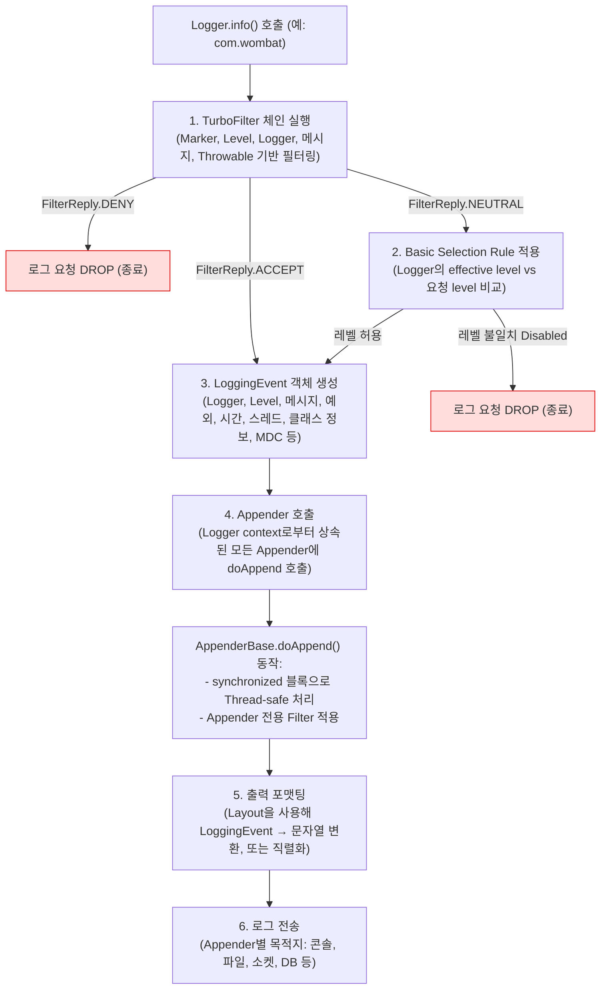

# 스프링에서 로깅이란

- 스프링은 원래 JCL `Jakarta  Commons Logging`을 사용해서 로깅을 했다고 한다.

## JCL (commons-logging)

- JCL은 로깅 라이브러리가 아니라 로깅 추상화 라이브러리인데, 로깅 라이브러리의 선택권은 애플리케이션 개발자에게 있다.
- 라이브러리나 프레임워크는 주로 로깅 추상화 라이브러리를 사용한다.
- JCL의 로깅 구현체를 찾는 방법은, 
  - 설정 파일에서 찾고
  - 애플리케이션 클래스패스에서 Log4j구현체를 찾아보고
  - 애플리케이션이 JDK 1.4에서 구동중인지 확인하고
  - 아무것도 못 찾으면 기본 구현체를 사용한다.

### JCL의 문제점

- JCL이 구현체를 선택하는 시점이 **런타임**이라 클래스 로더에 의존적이다.
- 따라서 가비지 컬렉션이 제대로 작동하지 않는 치명적인 문제점이 있다.
- 문제 해결을 위해 클래스 로더 대신에 **컴파일 시점**에 구현체를 선택하도록 변경하면서 도입된 것이 **SLF4J**이다.

## [SLF4J](https://www.slf4j.org/manual.html) (Simple Logging Facade For Java)

> Facade란? 복잡한 시스템을 감추고 단순한 인터페이스 하나로 제공하는 방식.  
> 여러 로깅 구현체들의 복잡한 구조를 가려주고 공통된 껍데기만 보여주기 때문에 Simple Logging Facade인 것!  

- SLF4J는 라이브러리 인터페이스 역할이고, **Logback**이 실질적인 로깅 라이브러리 구현체다.
  - 각각 다른 로깅 라이브러리를 사용한 라이브러리들을 통합해서 로깅을 하고 싶은 목적에서 SLF4J를 사용해 인터페이스는 통일하되, 구현체를 갈아끼우는 형태인 것이다.
- 로깅 구현체를 런타임이 아닌 **컴파일 타임**에 정한다.
- 세가지 모듈 Bridging, API, Binding을 제공한다.
- SLF4J는 클래스 별로 Logger를 사용한다.

- SLF4J의 이점: SLF4J 추상화를 사용하면 코드상에서는 org.slf4j.Logger 인터페이스만 의존하므로, 실제 로깅 프레임워크를 Logback에서 Log4j2로 교체하더라도 애플리케이션 코드 변경 없이 의존성 설정만 바꿔치기 하면 된다. 즉, SLF4J는 각기 다른 로깅 시스템을 통일된 방식으로 사용할 수 있게 해주는 계층이며, 바인딩 모듈이 그 다리를 놓아주는 원리이다.

### StaticLoggerBinder 

SLF4J는 내부적으로 StaticLoggerBinder라는 클래스를 통해 실제 로깅 구현체에 바인딩한다.  
각 로깅 구현 라이브러리(Logback, Log4j2 등)는 자신만의 StaticLoggerBinder를 제공하며, SLF4J API 호출시 이 바인더가 해당 구현체의 LoggerFactory를 반환하여 결과적으로 그 구현체를 이용해 로그를 기록한다.  
예를 들어 Logback의 경우 logback-classic JAR에 StaticLoggerBinder가 내장되어 SLF4J가 Logback의 LoggerContext에 연결되고, Log4j2를 사용하려면 log4j-slf4j-impl 같은 JAR를 추가하여 SLF4J가 Log4j2의 로그 시스템에 연결되도록 한다.

- 하나의 바인딩 선택: SLF4J 환경에서는 반드시 하나의 로거 바인딩만 클래스패스에 존재해야 한다. 동시에 둘 이상의 구현체가 존재하면 어떤 것을 써야 할지 모호해지므로 경고 또는 오류가 발생한다.

## [Logback](https://logback.qos.ch/manual/architecture.html)

### 로그를 구성하는 3요소 Logger, Appenders, Layouts

- Logger는 로그를 만들어주는 요소
  - Logger = logback-classic module
- Appender는 로그를 어디에 보낼지 결정하는 요소 => 여러 appender를 동시에 등록 가능
- Layout은 보내기 전에 어떤 형식으로 로깅할지 결정하는 요소
  - Appender, Layout = logback-core

#### Logger

모든 로거는 원하는 로거를 매개변수로 입력받아서 LoggerFactory를 이용해 생성한다.

```java
Logger rootLogger = LoggerFactory.​getLogger(org.slf4j.Logger.​ROOT_LOGGER_NAME);
```

로거는 아래와 같은 레벨로 사용할 수 있으며, default는 DEBUG이다.

```java
package org.slf4j; 
public interface Logger {

  // Printing methods: 
  public void trace(String message);
  public void debug(String message);
  public void info(String message); 
  public void warn(String message); 
  public void error(String message); 
}
```

log의 적용 규칙은 아래와 같다.

> TRACE < DEBUG < INFO <  WARN < ERROR

##### LoggerContext

로깅 시스템의 전체 설정과 Logger 인스턴스를 관리하는 컨테이너이자 중심 객체

- 모든 Logger와 Appender, Layout, 설정 상태를 담고 관리하는 중앙 컨트롤러
- 로거 등록, 설정 로딩, Appender 연결, 로깅 트리 계층 관리 등 전반적인 상태 및 생명주기 관리

- 내부적으로 LoggerContext를 통해 Logback을 제어하지만, 개발자는 보통 application.yml이나 logback-spring.xml만 수정하면 된다.

#### Appender

로그 메세지를 받아서 콘솔, 파일, DB, 원격서버 등 원하는 곳으로 출력하는 역할이다.

```
[Logger] → [Appender] → 출력 대상(Console, File, Socket, DB 등)
                   ↘ [Layout] 포맷 설정
```

### 로깅을 일관되게 남기는 방법

#### 계층적으로 로그 남기기

보통 로거는 클래스 혹은 패키지명을 기준으로 생성되며, 로거 이름에 계층적 구조가 반영된다.

- com.helloworld.moduleA.ClassA에서 발생한 로그는 com.helloworld.moduleA 패키지에 속하게 된다. 따라서 상위 패키지별로 로그 레벨을 통일하면 하위 모듈들까지 동일한 레벨이 적용되어 전체 호출 흐름을 한 수준에서 관찰할 수 있다.
- 여러 모듈이 서로 다른 패키지명을 가진다면, 설정 파일에서 각 모듈의 패키지에 대해 동일한 로그 레벨을 지정하여 균일한 출력이 이루어지도록 하자.

- 로거가 패키지 계층 구조를 따르고 있다면 상위 패키지의 레벨만 변경해도 하위가 따라가기 때문에 로그 레벨 전파 고려해야 한다. 
  - 모듈 A -> B -> C로 이어지는 호출 흐름에서, A에서 DEBUG 레벨 로그를 보고자 한다면 B와 C에서도 DEBUG 레벨 로그가 나와야 흐름을 완전히 이해할 수 있다. 따라서 특정 기능을 디버깅할 때는 관련된 모든 모듈의 로그 레벨을 일괄적으로 올리는 것이 좋다. 

#### MDC(Mapped Diagnositc Context) 활용하기

- MDC를 사용하면 로그 이벤트에 공통 상호 연관 ID를 심어줄 수 있다. 

- 요청 시작 시 각 모듈의 코드에서 `MDC.put("traceId", 어떤값)`을 설정하고 로그 패턴에 `%X{traceId}`를 포함하면, 여러 모듈에 걸친 호출도 동일한 추적 ID를 로그에 남길 수 있다. 이렇게 하면 서로 다른 모듈이라도 같은 요청 흐름에서 발생한 로그를 식별하고 연결지어 볼 수 있어 연결성 있는 로그 분석이 가능하다.

```java
import org.apache.logging.log4j.ThreadContext;

ThreadContext.put("userId", "admin"); // 이 요청은 DEBUG 로그까지 출력됨
logger.debug("This is debug log for admin.");
```

##### DynamicThresholdFilter

- DynamicThresholdFilter는 Log4j 2에서 제공하는 동적 로그 필터 중 하나로, MDC값을 기반으로 로그 레벨 임계값을 다르게 적용할 수 있도록 도와주는 필터다.
- 즉, 사용자/세션/요청 등의 MDC 키값에 따라 로그 레벨을 유동적으로 다르게 설정하고 싶을 때 사용한다.

일반적인 로그 설정은 패키지명이나 클래스 기준으로 레벨을 고정하지만 다음과 같은 경우에는 요청이나 사용자 단위로 레벨을 다르게 적용하고 싶을 수 있다.

- 예시 상황:
운영 환경에서 전체 로그 레벨은 INFO로 유지하되,  

특정 사용자나 특정 요청에 대해서만 DEBUG 로그를 활성화하고 싶은 경우  

이럴 때 DynamicThresholdFilter를 사용하면 MDC 값에 따라 로그 레벨 임계값을 조절할 수 있어 유용하다.

- 작동원리 : 로그 출력 시점에 MDC(예: traceId, userId, sessionId 등) 값을 확인하고 해당 키 값에 대해 미리 정의한 로그 레벨 기준과 비교, 설정된 기준보다 낮은 로그는 무시되고, 기준 이상인 로그만 출력된다.

사용예시 log4j2.xml

```xml
<Filters>
  <DynamicThresholdFilter key="userId" defaultThreshold="INFO" onMatch="ACCEPT" onMismatch="DENY">
    <KeyValuePair key="admin" value="DEBUG"/>
    <KeyValuePair key="tester" value="TRACE"/>
  </DynamicThresholdFilter>
</Filters>
```

- key="userId": MDC에 저장된 userId 값을 기준으로 필터링
- admin 유저 → `DEBUG` 이상만 출력
- tester 유저 → `TRACE` 이상만 출력
- 그 외는 기본 `INFO` 이상만 출력
- `onMismatch="DENY"`: 기준 미달인 로그는 출력하지 않음

### Logback이 로깅을 하는 flow 예시



- TurboFilter: Context 전역 또는 조건부 필터링 (Marker, Level, Logger 등)
- Basic Selection Rule: 로거의 유효 레벨과 요청 레벨 비교
- LoggingEvent 생성: 요청 관련 모든 정보 + MDC
- Appender 호출: Thread-safe, Appender 전용 필터 가능
- 포맷팅: Layout 사용 or 직접 직렬화
- 전송: Appender 목적지로 출력

### 로그 레벨 독립 관리 시 주의사항

- 로그 레벨에 따른 성능에 대해 생각하기
  - 로그 레벨을 `DEBUG`/`TRACE`처럼 자세하게 설정하면 시스템 성능에 영향을 줄 수 있다. 상세 로그는 출력량 증가뿐만 아니라, 로그 메시지를 구성하는 연산 비용을 초래하는데, 예를 들어 문자열 연결이나 복잡한 메시지 생성이 로그 레벨 체크 없이 수행되면 불필요한 연산이 생긴다. 이를 완화하기 위해 SLF4J에서는 {} 플레이스홀더를 사용하는 지연 평가를 제공하지만, 경우에 따라 여전히 toString()같은 연산이 일어날 수 있다.
  - logger.isDebugEnabled()로 레벨을 확인하고 나서 로그를 만드는 방법을 선택하면 불필요한 연산을 줄일 수 있다.

- 보안 및 민감 정보 노출
  - 로그 레벨을 세분화하면 자칫 민감 정보가 노출될 위험이 있다. DEBUG 수준에서는 평소 출력되지 않던 내부 정보나 개인 정보까지 기록될 수 있으므로, 서비스별로 로그 레벨을 조정할 때 개인정보나 기밀 데이터가 로그로 남지 않도록 주의해야 한다. 특히 운영 중 동적 변경을 허용한 경우, 해당 기능(예: Actuator의 /loggers 엔드포인트 등)에 대한 접근 통제를 철저히 해야 한다. 예컨대 2021년 말에 발견된 Log4j2의 심각한 취약점(Log4Shell)은 로그 메시지 처리를 악용한 것이므로, Log4j2를 사용한다면 최신 보안 패치 버전으로 업그레이드하여 이러한 known 이슈를 해소해야 한다.

- 설정 충돌 및 일관성
  - 하나의 JVM 내에서 복수의 로깅 프레임워크를 혼용하면 충돌이 발생하거나 의도치 않은 동작이 나올 수 있다. SLF4J 바인딩은 한 번에 하나만 존재해야 하므로, 각 서비스별로 어떤 로깅 구현을 쓸지 명확히 하고 불필요한 의존성은 제거해야 한다.
  - 예를 들어, Spring Boot 기반 서비스 A는 Logback을, 서비스 B는 Log4j2를 쓴다면 각각 종속성이 달라질 것이고, 한 서비스 내에서 두 가지를 함께 쓰지 않도록 해야 한다. 또한 여러 서비스가 한 서버에서 동작하며 공용 자원(예: 동일한 로그 파일 경로나 포트 등)을 사용한다면, 로그 설정이 서로 침범하지 않게 유의해야 한다. 서비스별로 로그 파일을 구분하거나, 컨테이너 환경이라면 콘솔 출력만 하고 중앙 로그 수집기로 모으는 편이 안전하다.
  - 환경별 설정 충돌도 피해야 한다. 예컨대 개발 환경에서는 특정 패키지를 DEBUG로 하고 운영에서는 INFO로 하는 등 프로파일별 설정을 관리하되, 이를 깜빡하고 운영에 디버그를 남겨두는 실수를 조심해야 한다.